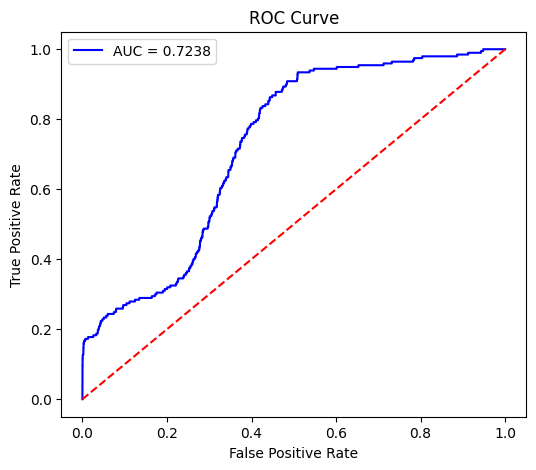

<h1>Welcome to Insider Threat Detection World</h1>
 

Insider threats are among the most challenging cybersecurity risks, where individuals within an
organization — such as employees, contractors, or partners — intentionally or unintentionally
compromise sensitive information. These threats can manifest as data leaks through emails,
unauthorized access to confidential files, or even sabotage of critical systems.

<h4>So i have provided a full fledged AI model for detecting Insider based on there system's log, email communications, web browsing and etc.</h4>

I have Used CERT datset version 4.2 can be found at https://kilthub.cmu.edu/articles/dataset/Insider_Threat_Test_Dataset/12841247/1 . After a lot of preprocessing and 
features have been extracted and fed to LSTM-Autoencoder and risk scores have been pridicted. In the model Folder you can find trained model. Other folders consists data as they named. 

<h3>Check These Performance metrices</h3>
<ul>
  <li>Accuracy : 92% </li>
  <li>Confusion Metrix:</li>
  
  <li>ROC-AUC curve: </li>
  
  <li>Reconstruction Error Distribution: </li>
  
  <li>Epoch vs Val loss: </li>
   
</ul>

<h3>Take a look of dashboard</h3>
<a href="https://youtu.be/6VqIfOs4PuI">
Click for Video
</a>

<h3>For the dashboard </h3>

You can pull the docker image and run them (Visit following docker hub public repo) 

https://hub.docker.com/repository/docker/bkeshav218/insider-threat-detection-new 

